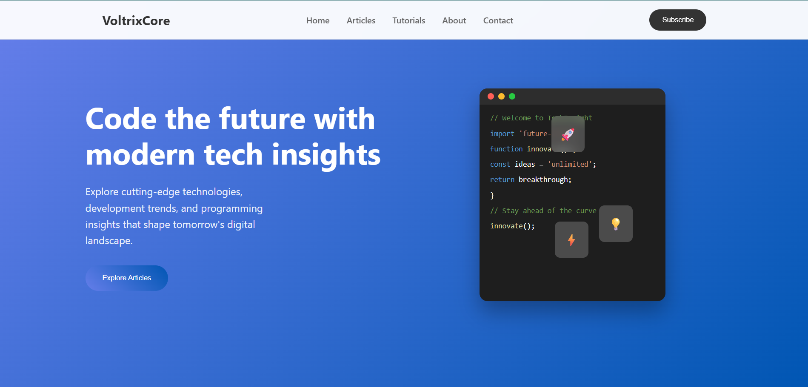

# VoltrixCore TechBlog

  

Welcome to **VoltrixCore TechBlog** – a modern tech blog where we share insights, tutorials, and resources on web development, software engineering, and emerging technologies.  

## 🚀 About the Project
VoltrixCore TechBlog is built to:
- Share technical knowledge in a clear and practical way
- Cover topics such as AI, Top Side hustles in the tech industry and many more
- Inspire developers with articles on modern trends in technology

## 📂 Project Structure
/Blog
├── index.html # Homepage
├── style.css # Main styles
├── scripts.js # JavaScript functionality
├── posts/ # Blog post pages
└── assets/ # Images, fonts, etc.

## 🛠️ Tech Stack
- **HTML5**  
- **CSS3**  
- **JavaScript (ES6+)**  
- Future plans: Firebase / React integration  

## 🌍 Live Demo
voltrixcore.web.app 

## 🤝 Contributing
Contributions are welcome!  
- Fork the repository  
- Create a new branch (`git checkout -b feature-branch`)  
- Commit your changes (`git commit -m "Add feature"`)  
- Push to your branch (`git push origin feature-branch`)  
- Open a Pull Request  

## 📜 License
This project is licensed under the MIT License.  
---

✨ Created with passion by **Kesaobaka Lekaote**  

